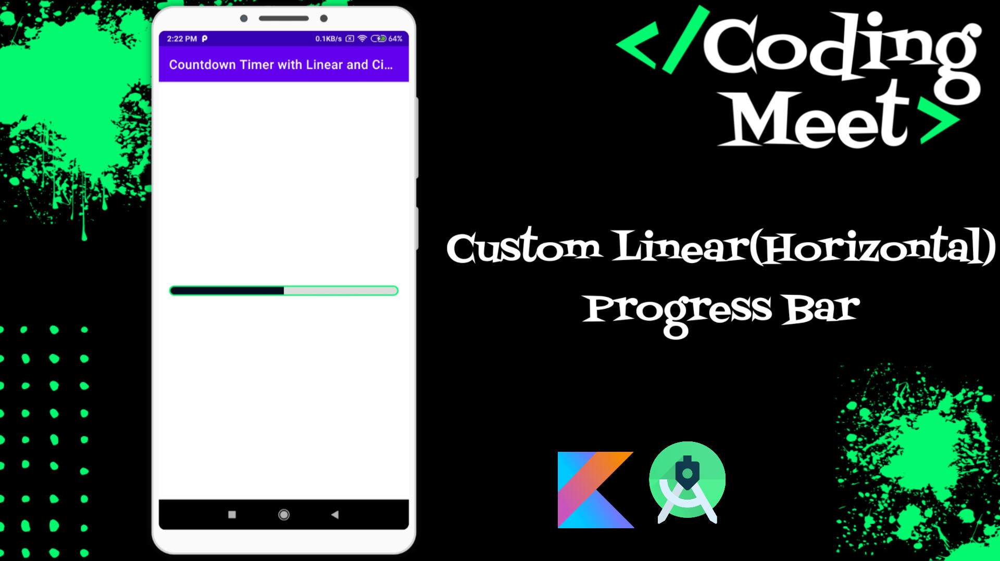
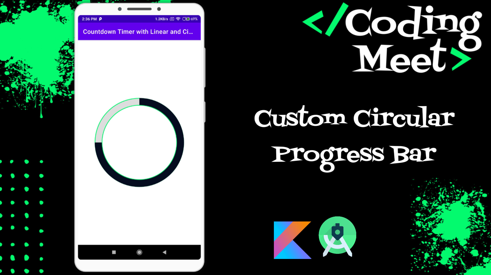
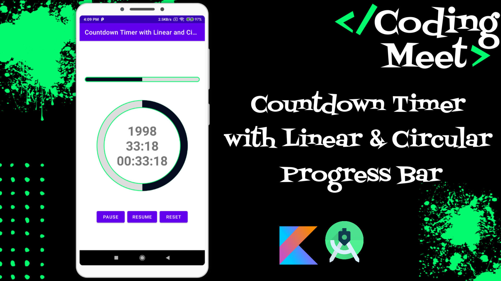

# Android Studio Kotlin Tutorials - Countdown Timer with Progress Bar

## Overview

This tutorial series covers the implementation of a Countdown Timer with both Linear (Horizontal) and Circular Progress Bars in Android Studio using Kotlin. Each video focuses on a specific aspect of creating a custom progress bar and integrating it into a countdown timer application.

## Video List

1. [**How to Implement Custom Linear (Horizontal) Progress Bar in Android Studio Kotlin**](https://youtu.be/NXuXbXN1llY?si=7Ie8in5u0i_HVRBJ)

2. [**How to Implement Custom Circular Progress Bar in Android Studio Kotlin**](https://youtu.be/NXuXbXN1llY?si=7Ie8in5u0i_HVRBJ)

3. [**How to Implement Countdown Timer with Linear & Circular Progress Bar in Android Studio Kotlin**](https://youtu.be/NXuXbXN1llY?si=7Ie8in5u0i_HVRBJ)

Stay tuned for each tutorial in the series, and don't forget to like, subscribe, and hit the notification bell to stay updated with our latest content! 💰📱

## Support the Project

If you find this tutorial series helpful and would like to support the development of more content, consider buying me a coffee! Your support helps in creating high-quality tutorials.

Your generosity is greatly appreciated! Thank you for supporting this project.
